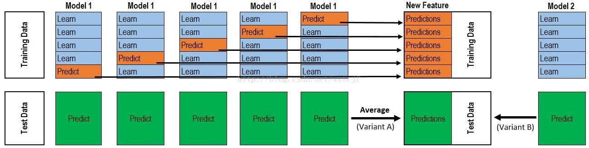

### 一文带你深入了解模型融合Ensemble(深度+代码)
 本作品采用<a rel="license" href="http://creativecommons.org/licenses/by-nc-nd/3.0/cn/">知识共享署名-非商业性使用-禁止演绎 3.0 中国大陆许可协议</a>进行许可。

在实际工作中，单模型遇到了瓶颈，一般这个时候提升模型效果，一种是做特征，另外一种就是利用复杂模型，一边探索特征，一边了解了些模型融合的知识。发现了kaggle很经典的材料。原文很长，干货太多，本文以[KAGGLE ENSEMBLING GUIDE](https://mlwave.com/kaggle-ensembling-guide/)为主线，整理了ensemble的多种方法，尽可能通俗的讲明白ensemble。一共介绍

#### Voting ensembles（投票）
- 我们常见的投票机制，少数服从多数，针对分类模型。
- 这里主要解决两个问题，一个是ensemble为什么能降低误差，另一个是融合弱相关的结果效果更好。

1.为什么ensemble会取得更好的效果：
假设我们有10个样本，真实数据都是1：
> 样本：1111111111

此外，我们通过模型A，B，C得到准确度（Accuracy）分别为80%，70%，60%的结果分别为：
>A: 1111111100 = 80% accuracy
>B: 0111011101 = 70% accuracy
>C: 1000101111 = 60% accuracy

通过简单的ensemble （vote：ABC同时对一个样本进行投票，投票数大于等于2的记为1，否则为0），于是得到结果Z为：
>Z: 1111111101 = 90% accuracy

2.选择弱相关性的融合
同上，10个样本，真实数据都是1。通过模型A，B，C得到准确度分别为80%，80%，70%的结果（单模型效果明显比之前的模型们要好），但是三个模型高度相关。通过majority vote得到结果Z：
>样本：1111111111
A: 1111111100 = 80% accuracy
B: 1111111100 = 80% accuracy
C: 1011111100 = 70% accuracy
Z: 1111111100 = 80% accuracy

 结果并没有提高。反而不如上三个表现较差但是弱相关的模型融合效果好.

- 这里的相关性使用的是皮尔逊相关性[代码：correlations.py](https://github.com/cloudinbanana/Kaggle-Ensemble-Guide/blob/master/src/correlations.py)
- 这里介绍的是公平投票 [代码：kaggle_vote.py
](https://github.com/cloudinbanana/Kaggle-Ensemble-Guide/blob/master/src/kaggle_vote.py)
- 还可以使用带权重的投票，效果的越好的模型权重越高，比如权重为1/loss
- 几何权重投票，有些情况下较公平投票效果更好 [代码：kaggle_geomean.py](https://github.com/cloudinbanana/Kaggle-Ensemble-Guide/blob/master/src/kaggle_geomean.py)
 
#### averaging（平均）
- 平均法一般是针对回归问题的。字面意思理解就是对结果求平均值。[代码：kaggle_avg.py](https://github.com/cloudinbanana/Kaggle-Ensemble-Guide/blob/master/src/kaggle_avg.py)
- 但是直接对结果求平均值会有度量上的问题，不同的方法预测的结果，融合的时候波动较小的起的作用就比较小，为了解决这个问题，提出了Rank Averaging，先将回归的值进行排序，在利用均匀分布打分。[代码：kaggle_rankavg.py](https://github.com/cloudinbanana/Kaggle-Ensemble-Guide/blob/master/src/kaggle_rankavg.py)
- 一个小栗子：

模型1：
>Id,Prediction 
1,0.35000056 
2,0.35000002 
3,0.35000098 
4,0.35000111 

模型2：
>Id,Prediction
1,0.57
2,0.04
3,0.99
4,0.96

模型1和模型2直接averaging融合的话，模型1几乎对模型2没有影响，就是我们刚才说的波动较小的模型在融合过程中起的作用较小的问题。
我们采用Rank Averaging这种方式，则有：

先将结果排序： 
>模型1：
>Id,Rank,Prediction 
1,1,0.35000056 
2,0,0.35000002 
3,2,0.35000098 
4,3,0.35000111 
模型2：
>Id,Rank,Prediction 
1,1,0.57
2,0,0.04
3,3,0.99
4,2,0.96

对排序结果进行归一化：
>模型1：
Id,Prediction
1,0.33
2,0.0
3,0.66
4,1.0
模型2：
Id,Prediction
1,0.33
2,0.0
3,1.0
4,0.66

再对归一化后的排序结果融合打分： 
>Id,Prediction 
1,0.33
2,0.0
3,0.83 
4,0.83

#### Stacking（堆叠）
- Stacking是通过一个元分类器或者元回归器整合多个模型的集成学习技术。基础模型利用整个训练集做训练，元模型利用基础模型做特征进行训练。一般Stacking多使用不同类型的基础模型
- 下图是介绍stacking时，必备的一张图（以5-Fold Stacking 为例）

- 整个过程有点像CV。
- 首先，将训练集分成5份，共计迭代5次，每次迭代都将4份数据作为Train Set对每个Base Model进行训练，然后剩下的一份作为Hold-out Set（可以类比cv中的测试集）进行预测。同时，每个Base Model在Test Set的预测值也要保存下来。经过5-Flod迭代后，我们获得了一个： 
- **#训练数据行数 * # Base Model数量的矩阵（每个Base Model在进行cv 的过程，分别会对每一份Hold-out-set进行预测，汇总产生一个对所有训练集的预测）**，这个矩阵作为第二层的训练数据进行训练，得到model B
- 然后将之前保存的每个Base Model对测试集进行的预测的平均值拼成一个 ：
- **#测试数据行数 * #Base Model 数量的矩阵（每个Base Model会对测试集进行5-fold次预测，所以在拼测试数据的预测结果之前，需要对每个Base Model预测5-Fold次的预测结果求均值）**
- 最后，再根据model B对测试集的预测进行预测。完成了一个5-fold的Stacking

- 原文中为了方便读者更好的理解，给出了一个2-fold stacking的例子，这里进行简单的介绍：
	- 将测试集分为两部分：train_a和train_b
	- 将基模型在训练集train_a上训练并在训练集train_b上预测
	- 同样将基模型在训练集train_b上训练并在训练集train_a上预测
	- 将基模型在所有训练集上训练在测试集上预测
	- 利用第一阶段在训练集train_a和train_b的预测训练我们的stacker模型。
	- 我们对测试集进行基模型预测产生特征时，既可以像上述一样让基模型在所有训练集上训练一遍，然后对测试集进行一次预测，也可以利用基模型在 k-fold 产生的模型对测试集进行预测然后取平均。
- 下面这篇超级棒的博客给出了一个5-fold Stacking实现的代码（其中模型和Fold都可以进行个性化修改） [如何在 Kaggle 首战中进入前 10%](https://dnc1994.com/2016/04/rank-10-percent-in-first-kaggle-competition/#more)

#### Blending（非交叉堆叠）
- Blending的出现是为了解决Stacking在交叉验证阶段出现的数据泄露（stage2的input会包含output的信息，具体参考[为什么做stacking ensemble的时候需要固定k-fold？](https://www.zhihu.com/question/61467937/answer/188191424)），容易产生过拟合，Blending直接使用不相交的数据集用于不同层的训练，通俗的理解就是不做交叉验证，而是将训练集分成3:7两个部分，70%作为训练集，对30%验证集和测试集进行预测，第二层是对30%验证集的预测结果进行训练，不存在数据泄露的问题。但是存在30%验证集数量较少，容易过拟合的问题，所以在实际融合中，使用Stacking还是Blending是有很多Trick的。
- 下面来一个Blending的例子

1. 首先需要对原始训练数据集进行分割。一般训练集比例为60%-80%，这个比例不易太大，太大的话，容易第二层模型训练数据较少，产生过拟合。
2. 假设：原始训练数据集(D)分为训练数据集(DT)和验证数据集(DA)，测试数据集为(DP)
2. 构建模型阶段：构建M个模型M1,M2,...MM,以模型Mi为例，对训练集DT进行学习，得到模型Mi。学习完毕后，对验证数据DA进行预测为DA_Mi,再对测试数据进行预测得到DP_Mi; 对验证集得到的DA_M1,DA_M2,...DA_MM, 作为新的特征。将这些新的特征作为第二层模型的输入，训练得到模型Model0，将测试集得到的DP_M1,DP_M2,...DP_MM,将这些特征作为预测数据的输入，用Model0预测，得到最终的结果。
3. 下面三个和blending相关的代码实现
[Blending介绍以及blending在回归算法和分类算法的实现](https://github.com/Anfany/Machine-Learning-for-Beginner-by-Python3/tree/master/Blending)
[blend.py 五种模型融合实例](https://github.com/emanuele/kaggle_pbr/blob/master/blend.py)
[blend_proba.py](https://github.com/cloudinbanana/Kaggle-Ensemble-Guide/blob/master/src/blend_proba.py)

#### Stacking 的一些奇淫技巧
- 非线性的stacker例如：GBM,KNN,NN,RF 会对特征和Base Model有较好的补充
- Feature-Weighted LinearStacking (FWLS)，相比于一般的stacking只是使用linear regression将不用的模型通过线性权重融合到一起。这里的权重为特征的线性组合，整个模型被拓展为feature*model组合的形式。[参考：Feature-Weighted Linear Stacking](https://arxiv.org/pdf/0911.0460.pdf)
- 分类问题和回归问题利用stacking互相转化。
	- 分类问题可以在第一层利用分位数回归得到预测结果，作为第二层的输入
	- 回归问题则需要先对y进行分类（比如利用分位点将连续的y分为几类），第一层用分类模型对类别进行预测，作为第二层的输入。
- 还有比赛中大神提到的无监督stacking，online stacking ，如果大家感兴趣的话我们再进行深入讲述。

#### Reference（本文参考）
- [Kaggle-Ensemble-Guide](https://github.com/lenguyenthedat/Kaggle-Ensemble-Guide)
- [模型融合-Kaggle Ensembling Guide](https://blog.csdn.net/h4565445654/article/details/70111058)
- [[机器学习]集成学习--bagging、boosting、stacking](https://blog.csdn.net/zwqjoy/article/details/80431496)
- [Ensemble Learning to Improve Machine Learning Results](https://blog.statsbot.co/ensemble-learning-d1dcd548e936)
- [集成学习方法1](https://www.jianshu.com/p/0a23d578ac81)

#### Reference2（Kaggle-Ensemble-Guide原文涉及到的所有链接）
- [KAGGLE ENSEMBLING GUIDE](https://mlwave.com/kaggle-ensembling-guide/)这篇博文不知道作者写用了多久，个人觉得把里面的链接和论文都看完，少说也得半个月，强度绝对不低于读一本大块头，同时还有很多实际比赛的代码分享，对个人提升大有裨益。
- 下面是对原文出现的链接的汇总和一个简单的总结，感兴趣的留言，我们下一期会继续深入这个主题。

- [ Vitaly Kuznetsov](https://cims.nyu.edu/~vitaly/) ： Research Scientist at Google AI
- [Pearson correlation](http://onlinestatbook.com/2/describing_bivariate_data/pearson.html) ：皮尔逊相关性
- [UC Irvine Machine Learning Repository](https://archive.ics.uci.edu/ml/index.php) :公开数据库
- [Covertype Data Set ](https://archive.ics.uci.edu/ml/datasets/Covertype) ：森林覆盖类型数据
- [Forest Cover Type Prediction](https://www.kaggle.com/c/forest-cover-type-prediction)：kaggle 比赛
- [Forest cover type prediction](http://www-di.inf.puc-rio.br/~milidiu/inf2979/anteprojetos/gribel.pdf) 森林覆盖比赛多种算法比较以及blending性能比较论文
- [CIFAR-10 Competition Winners: Interviews with Dr. Ben Graham, Phil Culliton, & Zygmunt Zając](http://blog.kaggle.com/2015/01/02/cifar-10-competition-winners-interviews-with-dr-ben-graham-phil-culliton-zygmunt-zajac/)：CIFAR-10 比赛获胜者采访，可以学到很多trick
- [A Brief Overview of Deep Learning](http://yyue.blogspot.com/2015/01/a-brief-overview-of-deep-learning.html)：深度学习大纲
- [Dropout: A Simple Way to Prevent Neural Networks from
Overfitting](http://www.cs.toronto.edu/~rsalakhu/papers/srivastava14a.pdf)：Dropout的介绍
- [Why calibration works](https://www.kaggle.com/cbourguignat/why-calibration-works)概率校准的优良表现，分类算法输出时可以考虑
- [Feature-Weighted Linear Stacking](https://arxiv.org/pdf/0911.0460.pdf) ：特征为权重的stacking
- [Combining Predictions for Accurate Recommender Systems](http://elf-project.sourceforge.net/CombiningPredictionsForAccurateRecommenderSystems.pdf)：推荐系统中的ensemble应用
- [Bagging Predictors](http://statistics.berkeley.edu/sites/default/files/tech-reports/421.pdf)：一篇bagging理论的论文
- [Stacked Generalization](https://www.researchgate.net/publication/222467943_Stacked_Generalization) ；stacking如何降低泛化误差
- [kaggle_pbr/blend.py](https://github.com/emanuele/kaggle_pbr/blob/master/blend.py)：blending代码
- [Yangela](https://www.kaggle.com/yansoftware)：kaggler
- [Tuning doesn't matter. Why are you doing it?](https://www.kaggle.com/general/14469)：搜参在ensemble中讨论，结合stacked generalization 看更佳
- [41599 via TSNE, meta bagging](https://www.kaggle.com/c/otto-group-product-classification-challenge/discussion/14295) ：TSNE, meta bagging
- [t-SNE](http://lvdmaaten.github.io/tsne/)：TSNE
- [007. Machine learning best practices we've learned from hundreds of competitions - Ben Hamner](https://www.youtube.com/watch?v=9Zag7uhjdYo)  ：kaggler的参赛经验分享视频，无字幕==
- [Profiling Top Kagglers: KazAnova, Currently #2 in the World](http://blog.kaggle.com/2015/05/07/profiling-top-kagglers-kazanovacurrently-2-in-the-world/)：Top Kagglers的采访
- [inversion](https://www.kaggle.com/inversion)：Kaggler
- [strategy for top 25 score](https://www.kaggle.com/c/otto-group-product-classification-challenge/discussion/14315)：取得top25的算法和模型融合策略
- [MLWave/hodor-autoML](https://github.com/MLWave/hodor-autoML)：autoML的雏形
- [1st PLACE - WINNER SOLUTION - Gilberto Titericz & Stanislav Semenov](https://www.kaggle.com/c/otto-group-product-classification-challenge/discussion/14335)：top1的解决方案，很酷
- [Otto Product Classification Winner's Interview: 2nd place, Alexander Guschin ](http://blog.kaggle.com/2015/06/09/otto-product-classification-winners-interview-2nd-place-alexander-guschin/)：top2 的解决方案
- [Dark knowledge ](https://www.ttic.edu/dl/dark14.pdf)：Geoffrey Hinton, Oriol Vinyals & Jeff Dean 三位大佬的独家黑魔法ppt
- [HUMAN ENSEMBLE LEARNING](https://mlwave.com/human-ensemble-learning/)：群体智慧，从另外一个角度讲为什么ensemble works
- [MLWave/Kaggle-Ensemble-Guide](https://github.com/MLWave/Kaggle-Ensemble-Guide)：本文的github代码库
- [More Is Always Better: The Power Of Simple Ensembles](http://www.overkillanalytics.net/more-is-always-better-the-power-of-simple-ensembles/)：少就是多哲学的反面，越多越好，这篇真的超有意思，有时间翻译分享下
- [Tradeshift Text Classification](https://www.kaggle.com/c/tradeshift-text-classification/discussion/10629)：Benchmark with sklearn
- [Ensemble Learning: The Wisdom of Crowds (of Machines)](https://www.slideshare.net/liorrokach/ensemble-learning-the-wisdom-of-crowds-of-machines)：有一篇讲群体智慧的，ensemble的思想来源。