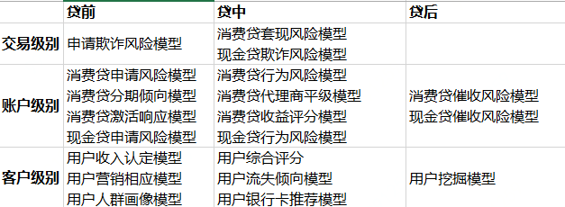

### 风控从业者不能错过的分享

 本作品采用<a rel="license" href="http://creativecommons.org/licenses/by-nc-nd/3.0/cn/">知识共享署名-非商业性使用-禁止演绎 3.0 中国大陆许可协议</a>进行许可。

之前写过关于<数据化风控>的总结，更多的是讲传统的评分卡模型的搭建过程。而现在很多机器学习和深度学习的知识已经被应用到风控反欺诈中。最近几个月，听了一些北京地区风控相关的分享，这里给大家做个分享。

#### 机器学习在反欺诈的应用（新浪金融）
- 反欺诈的几个方面
  - 第一层：**设备与网络层**，代理检测，IDC检测(互联网数据中心（Internet Data Center）简称IDC。通过互联网通信线路、带宽资源，建立标准化的专业级机房环境),模拟器虚拟机检测，木马检测
  - 第二层：**用户行为层**，注册行为，登录行为，交易行为，事件序列，时间间隔异常
  - 第三层：**业务频次层**，注册频次，登录频次，交易频次，地域频次，时间间隔频次
  - 第四层：**业务事件异常层**，注册异常度，登录异常度，交易异常度，地域异常度，时间段异常度
  - 第五层：**欺诈团伙图谱**，羊毛党发现，代理池发现，羊毛党设备发现，肉鸡网络发现（电脑肉鸡，就是拥有管理权限的远程电脑。也就是受别人控制的远程电脑），跨应用欺诈团伙
- 反欺诈规则的几个缺点
  -  策略比较强，命中直接拒绝，无法考虑之间的深层次的关系（比如欺诈概率非0即1）
  -  没有考虑用户从信用风险到欺诈风险的转移

- LSTM异常检测注意事项(long short term memory)
  - **时间序列的长度**，每个时间序列的embedding限制固定长度，
  - **缺失数据**，缺失数据补0
  - **离散数据的embedding**，上千维的变量不要onehot，可以选择woe或者其他方式
  - **异常检测评估**，针对异常样本较少的情况，可以采用仿真的情况
- 反欺诈中图谱的应用
  - 原因：黑产会最大程度的利用已有资源
  - 行为：重复使用现在设备和信息进行不同的申请，导致公共相同的手机号，登录ip，硬件设备形成关联网络
  - 识别方法：1. 将数据进行关联，形成网络 2. 使用社会关系网络分析工具，分析关系网络中是否具有大量公共设备等拓扑网络
- **欺诈样本的收集**：首逾，贷后催收，策略拒绝，做采样，好坏人样本采样比例不同
-  **收获：**
>1.深度学习做反欺诈的一些方向 
2.欺诈样本的定义 
3.欺诈模型的使用（放在规则前）

#### 自动化特征工程和自动建模在风控场景的应用（融360）
- 建模流程：10%业务分析，60%特征工程，30%模型开发
- 自动化特征后以维度来尝试更多的模型方案：
	- **样本范围**：单个产品样本，单个产品样本+同类产品样本
	- **建模时间段**：17/01-18-01,18/01-18/03
	- **表现期定义**：MOB6,MOB3
	- **BAD定义**M60,M30
	- **特征范围**：自有特征，自有特征+三方特征（最后输出一个分数）
	- **建模算法**：LR,XGB（目前xgb的分布式支持度较高），lgb（单机训练OK，但是上线支持度不高）

- 基础数据的相似性为自动特征提供了可能性
	- **数据分类：**时间型数据，分类型，数值型，标识型

- 人工通过RFM模型（衡量客户价值模型）构造出大部分特征
	- **R：**Recency，交易时间间隔
	- **F：**Frequency，交易次数
	- **M: **Monetary，交易金额
	- 运营商数据为例：近几天（时间窗口） 夜晚（时间段） 主叫（可省略，） 通话时长（特征） 和（聚合方式）
	- RFM模型+趋势性的（最近三个月/最近六个月）
	- **关系网络**也可以通过转化利用RFM模型构造特征：本人通过联系电话，找到一度二度联系人，他们在平台的逾期金额，逾期天数，通过一度，二度关系，聚合到本人维度，我们就可以得到：**一度联系人 逾期金额，逾期天数**

- 通过配置文件定义基础数据类型和计算逻辑
- 完整的自动化特征工程：
	1. raw data
	2. 数据标准化
	3. 自动组合 （配置参数计算）（5自动寻优返回）
	4. 特征计算
	5. 自动评估（自动寻优到3）
	6. 输出特征
- 自动特征举例
	- 设备特征
		- 近几月和电话本联系人通话情况
		- 安装app类别
	-  运营商特征
		-  近几个月通话情况
		-  近几个月流量使用情况
	- 设备和用户订单交易特征
		- 同一gps下用户的申请和还款表现
		- 同一设备号下用户的申请和还款表现
	- 多头特征
		- 近几个月用户在其他机构的借款额
		- 近几个月用户在其他机构的违约金额  
	 
- 自动综合多种算法和筛选规则选择有效的特征
	- 多种算法：LR，xgb，
	- 多种排序：数据源（保留特征多样性），IV，rf_rank，，xgb_rank 
	- 逻辑回归评分卡：自动分箱，自动调整单调性，转woe，同时提供手动调整的接口
	- XGB模型在入参有更多的选择，连续变量分箱，分类变量映射，模型参数分别采用：**1.经验 2.网格 3.随机搜索**

- **自动，全面，快速的模型效果评估**
	- **模型效果综合分：**psi，ks，Ranking（分别测试低分段和高分段ks）
	- **跨纬度：**变量维度，模型分维度
	- **跨样本：**train，test，oodbackscore，Early Performance（建模Y，早期表现Y）
	- **跨模型：**当前线上模型，不同版本模型
	- **输出：**建模报告：1. 模型表现汇总，2.模型决策&收益测算 3.LR结果 4. XGB结果 5. 变量PSI 6. 分数PSI 7.分数detiles 8. 变量逾期率排序性比对（**排序性**）

- 标准化输出-模型监控文件
	- 变量，总分的详细分数对比和PSI
	- 变量，总分的排序性对比和KS
	- 定时输出日报，周报，月报
	-  
**收获：** 
>1.观察期不一定很长（首逾，三个月，），根据测试结果决定  
>2.模型分重点注意排序性，**低分段的ks，高分段的ks**
>3.监控的重要性，监控反哺模型更新

#### 携程金融大数据风控算法实践（携程）
[携程金融大数据风控算法实践](https://www.infoq.cn/article/wxLR2fE5oTTD_geYTbAG)
最后一篇原文给出地址，由Datafun社区整理，这里分享一点个人觉得比较有用的点。
- 风控模型体系

- 版本更新
	- V0.1 业务经验 
	- V1 LR
	- V2 gbdt+lr
	- V3  dnn
	- V4 分形网络，CNN
	- [Fractalnet ： Ultra-DEEP NETURAL NETWORKS WITHOUT RESIDUALS](https://www.cnblogs.com/liaohuiqiang/p/9218445.html)
	- VX 迁移学习，无监督学习，在线监督学习
		- 跨场景，跨平台，跨产品线

利用分形网络，原文作者测试过 DNN，结论如下：
>在同等情况下，和 GBDT 之类的算法性能类似，并没有太明显的效果，一方面说明 GBDT 这类算法在处理非图像、语音、文本这类局部结构并不是特别明显的数据的优势，另一方面说明，不能直接将 CV\NLP 领域的算法拿来用，需要做一定的改造和优化，因此我们陆续使用和改造了 ResNet、FractalNet 等网络结构，相比于 DNN 和 GBDT 模型效果有比较明显的提升

这部分是笔者未来一段时间研究的方向。

结束语：本篇文章就三家风控领域的负责人在Datafun社区做的分享做了一个粗浅的总结，其中很多内容是值得反复挖掘研究的，更多的信息也可以关注datafun社区的公众号。如果你对其中的某个点感兴趣的话，欢迎公众号留言交流~